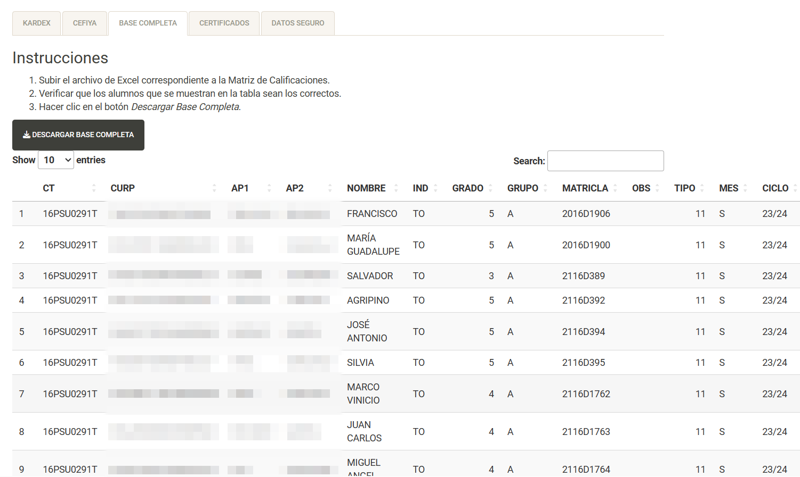

```{r setup, include = FALSE}
# Setup chunk
# Paquetes a usar
#options(htmltools.dir.version = FALSE) cambia la forma de incluir código, los colores

library(knitr)
library(tidyverse)
library(xaringanExtra)
library(icons)
library(fontawesome)
library(emo)
library(ggplot2)
library(latex2exp)
# set default options
opts_chunk$set(collapse = TRUE,
               dpi = 300,
               warning = FALSE,
               error = FALSE,
               comment = "#")

top_icon = function(x) {
  icons::icon_style(
    icons::fontawesome(x),
    position = "fixed", top = 10, right = 10
  )
}

knit_engines$set("yaml", "markdown")

# Con la tecla "O" permite ver todas las diapositivas
xaringanExtra::use_tile_view()
# Agrega el boton de copiar los códigos de los chunks
xaringanExtra::use_clipboard()

# Crea paneles impresionantes 
xaringanExtra::use_panelset()

# Para compartir e incrustar en otro sitio web
xaringanExtra::use_share_again()
xaringanExtra::style_share_again(
  share_buttons = c("twitter", "linkedin")
)

# Funcionalidades de los chunks, pone un triangulito junto a la línea que se señala
xaringanExtra::use_extra_styles(
  hover_code_line = TRUE,         #<<
  mute_unhighlighted_code = TRUE  #<<
)

# Agregar web cam

xaringanExtra::use_webcam()
```

```{r xaringan-editable, echo=FALSE}
# Para tener opciones para hacer editable algun chunk
xaringanExtra::use_editable(expires = 1)
# Para hacer que aparezca el lápiz y goma
xaringanExtra::use_scribble()
```

```{r xaringan-themer, include=FALSE, warning=FALSE}
# Establecer colores para el tema
library(xaringanthemer)
style_mono_light(base_color = "#00733b")
```

class: title-slide, middle, center
background-image: url(imgs/rladies_logo.png) 
background-position: 5% 5%
background-size: 15%


.center-column[
# `r rmarkdown::metadata$title`
## `r rmarkdown::metadata$subtitle`

###`r rmarkdown::metadata$author` 
###`r rmarkdown::metadata$institute` 
#### `r rmarkdown::metadata$date`
]

---
class: left
background-image: url(imgs/rladies_logo-alt.png) 
background-position: 2% 2%
background-size: 12%

# Contenido
* Introducción
* Lógica de Shiny
    + UI
    + SERVER
* Ejercicio
* Consejos
    + Desempeño
    + Seguridad

---
class: middle, center, title-slide
background-image: url(imgs/rladies_logo.png) 
background-position: 5% 5%
background-size: 12%

.center_column[
# Introducción
]


---
class: left, middle
background-image: url(imgs/rladies_logo-alt.png) 
background-position: 2% 2%
background-size: 12%

# ¿Qué es Shiny?
.pull-left[

]
.pull-right[
Es una paquetería de _open source_ que provee un _framework web_ con la finalidad de construir **aplicaciones web** usando **R** y **Python**. Lo más destacable es que no se requiere de conocimientos en _HTML_, _CSS_ o _JavaScript_.

Material auxiliar:
* [**Documentación Oficial**](https://shiny.posit.co/r/reference/shiny/latest/)
* [**Guía Rápida**](https://rstudio.github.io/cheatsheets/translations/spanish/shiny_es.pdf)
* [**Mastering Shiny**](https://mastering-shiny.org/)


]

**¿Cuándo usar Shiny?**
* Automatizar acciones repetitivas con cambios leves, e.g. gráficas.
* Compartir información de manera pública.


---
class: middle, center, title-slide
background-image: url(imgs/rladies_logo.png) 
background-position: 5% 5%
background-size: 12%

.center_column[
# UI
]


---
class: left, middle
background-image: url(imgs/rladies_logo-alt.png) 
background-position: 2% 2%
background-size: 12%

# Layout
.pull-left[

]
.pull-right[
Consiste en la organización general de la aplicación. Incluye los **paneles**, **filas**, **columnas**, etc.
].
---
class: left, middle
background-image: url(imgs/rladies_logo-alt.png) 
background-position: 2% 2%
background-size: 12%

# Componentes

.pull-left[
## INPUT
Se trata de todos los espacios que introduce el usuario, puede ser **texto**, **números**, **intervalos**, **archivos**, **fecha** etc.
]

.pull-right[
### Ejemplo

]


---
class: left, middle
background-image: url(imgs/rladies_logo-alt.png) 
background-position: 2% 2%
background-size: 12%

# Componentes

.pull-left[
### Ejemplo

]

.pull-right[
## OUTPUT
Se trata de todos los espacios en los que nuestra aplicación mostrará el resultado esperado, puede ser **texto**, **gráficas**, **tablas**, etc.
]

---
class: middle, center, title-slide
background-image: url(imgs/rladies_logo.png) 
background-position: 5% 5%
background-size: 12%

.center_column[
# SERVER
]


---
class: left, middle
background-image: url(imgs/rladies_logo-alt.png) 
background-position: 2% 2%
background-size: 12%

# ¿Qué es el server?
.pull-left[
Es el apartado en donde se utilizan y modifican los **inputs** para producir los **outputs**. Podemos verlo como una función donde lee los _inputs_ y escribe los _outputs_.
]
.pull-right[
```{r funciones, eval=FALSE}
renderPlot()
renderCachedPlot()
renderPrint() renderText()
dataTableOutput() renderDataTable()
renderImage()
tableOutput() renderTable()
renderUI()
downloadHandler()
createRenderFunction()
quoToFunction()
installExprFunction()
```

].

---

class: middle, center, title-slide
background-image: url(imgs/rladies_logo.png) 
background-position: 5% 5%
background-size: 12%

.center_column[
# CONSEJOS

]

---

class: left, top
background-image: url(imgs/rladies_logo-alt.png) 
background-position: 2% 2%
background-size: 12%

.pull-left[
## Desempeño
* Guardar en variables bloques de elementos.
* Crear diciconarios de la forma _Etiqueta_:valor para facilitar las opciones.
* Nombrar las variables de forma descriptiva.
* Utilizar pestañas cuando el _input_ es el mismo, pero los _outputs_ son diferentes.
* Separar en archivos la **UI**, el **Server** y las **funciones** para proyectos grandes.
]

.pull-right[
## Seguridad
* No guardar en el servidor de Shiny _datasets_ que contiene información sensible, es preferible cargarlos al correr la app para que una vez terminada la acción se borren del caché.
]


---

class: middle, center, title-slide
background-image: url(imgs/rladies_logo.png) 
background-position: 5% 5%
background-size: 12%

.center_column[
# EJERCICIO
]

---


class: left, middle
background-image: url(imgs/rladies_logo-alt.png) 
background-position: 2% 2%
background-size: 12%

# Primeros Pasos
1. Identifica el o los elemento que será automatizado.
2. Determina la fuente de la información a mostrar, e.g. _dataset fijo_.
3. Identifica los **inputs** y **outputs** necesarios para cada elemento.
4. Realiza un bosquejo muy general de los componentes.
5. Crea las funciones necesarias de la misma forma en la que lo harías en R.

---


class: left, middle
background-image: url(imgs/rladies_logo-alt.png) 
background-position: 2% 2%
background-size: 12%

# Manos Al Código
1. Crea un proyecto desde R Studio para matener el orden
2. Selecciona File -> New File -> Shiny Web App. Escribir el nombre deseado y de preferencia la opción _Multiple File_
3. Da clic en Run App.
--
 .center_column[
 **¡YA TIENES TU PRIMERA APP DE SHINY!**
]

---

class: left, middle
background-image: url(imgs/rladies_logo-alt.png) 
background-position: 2% 2%
background-size: 12%

# App de Ejemplo
.pull-left[
## UI
```{r ui_ejemplo, eval=FALSE}
fluidPage(
    titlePanel("Old Faithful Geyser Data"),
    sidebarLayout(
        sidebarPanel(
            sliderInput("bins",
                        "Number of bins:",
                        min = 1,
                        max = 50,
                        value = 30)
        ),
        mainPanel(
            plotOutput("distPlot")
        )
    )
)
```

]

.pull-right[
## SERVER
```{r server_ejemplo, eval=FALSE}
function(input, output, session) {

    output$distPlot <- renderPlot({
        x    <- faithful[, 2]
        bins <- seq(min(x), max(x), length.out = input$bins + 1)
        hist(x, breaks = bins, col = 'darkgray', border = 'white',
             xlab = 'Waiting time to next eruption (in mins)',
             main = 'Histogram of waiting times')
    })
}

```
]

---

---

class: left, middle
background-image: url(imgs/rladies_logo-alt.png) 
background-position: 2% 2%
background-size: 12%

# [Ejercicio](https://github.com/R-Ladies-Morelia/GGplotShiny/tree/main/LogicaShiny/ExploracionIris)


---

class: middle, center, title-slide
background-image: url(imgs/rladies_logo.png) 
background-position: 5% 5%
background-size: 12%

.center_column[
# GRACIAS
#### Jazmín López Chacón
#### jazlopezch@enesmorelia.unam.mx
#### jazmin.lopez.chacon@banorte.com
#### Github: tipicanerd
]

